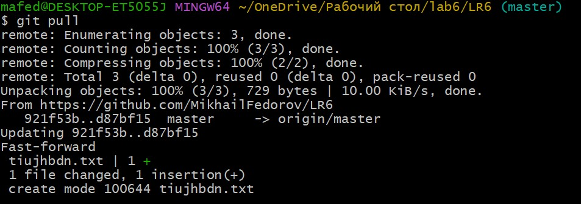
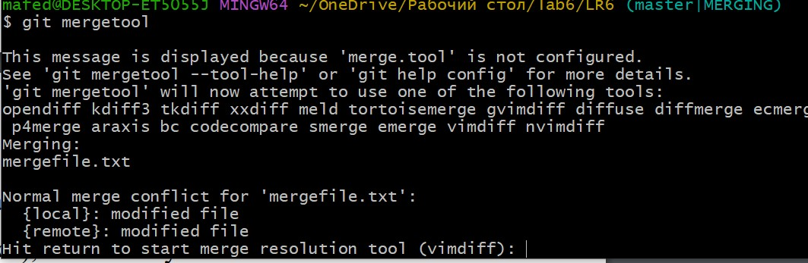
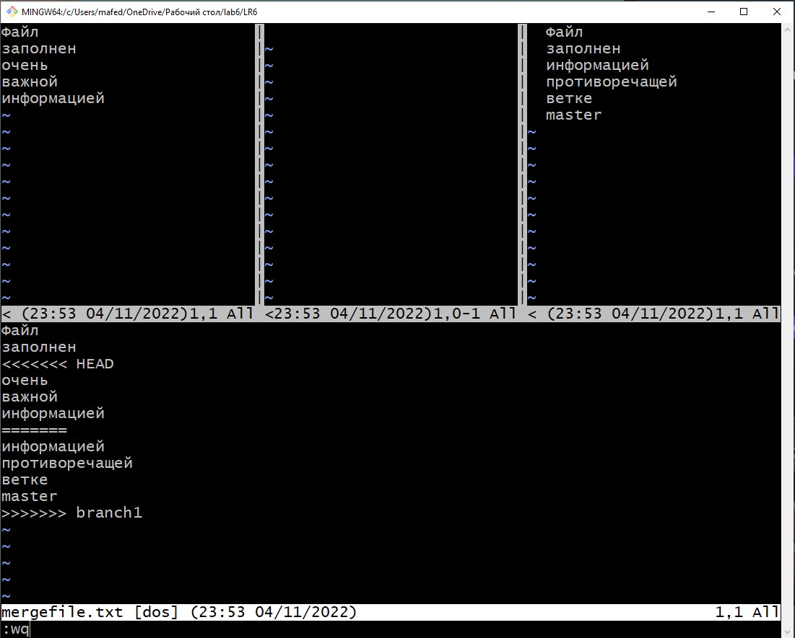

# LR6
Лабораторная работа №6

### Создание корневой папки LR6
Рисунок №1


### Клонирование удаленного репозитория и инициализация --global user.name user. email.
Рисунок №2


### Добавление файла с GitHub на лок репозиторий
Рисунок №3


### Обзор веток 
Рисунок №4



### История коммитов ветки branch1 и master.
Рисунок №5


Рисунок №6


### Слияние веток branch1 и master, появление конфликта и его решение с помощью mergetool
Рисунок №7


Рисунок №8



### Переход в редактор Vim. Изменение файла с помощью команды :diffoff
Рисунок №9


### Результат работы в редакторе Vim
Рисунок №10


### Результат слияния
Рисунок №11


### Создание 3 доп файлов и создание нового коммита
Рисунок №12



Рисунок №13


### Результат объединения веток master и branch1, показанное в истории коммитов
Рисунок №14


### Откат коммита на один шаг
Рисунок №15


### Создание новой ветки OTCHET
Рисунок №16


### Создание отчета в файле Readme.md с использованием редактора VScode

Рисунок №17


## ЛОГ КОМАНД
```
$ cd D:/LR6
$ git clone 
$ git pull
$ cd LR6
$ git pull
$ git log
$ git checkout branch1
$ git checkout master
$ git merge branch1
$ git mergetool
$ git status
$ git add .
$ git commit -m 'add base and txt'
$ git branch -d branch1
$ git branch
$ git reset --hard HEAD~1
$ git checkout -b 'OTCHET'
````
####